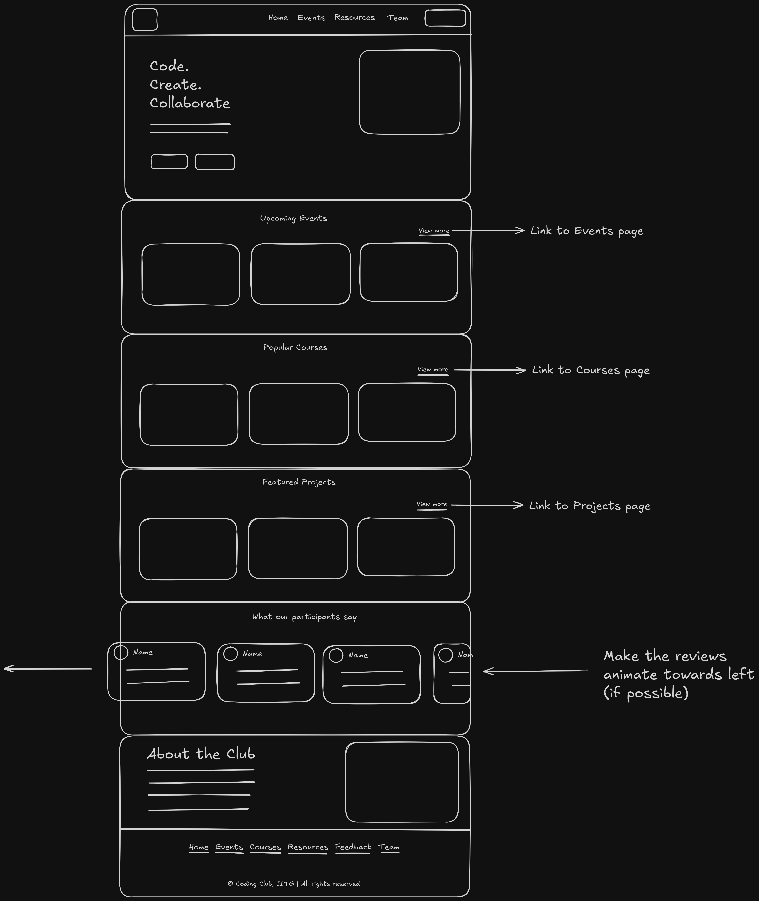
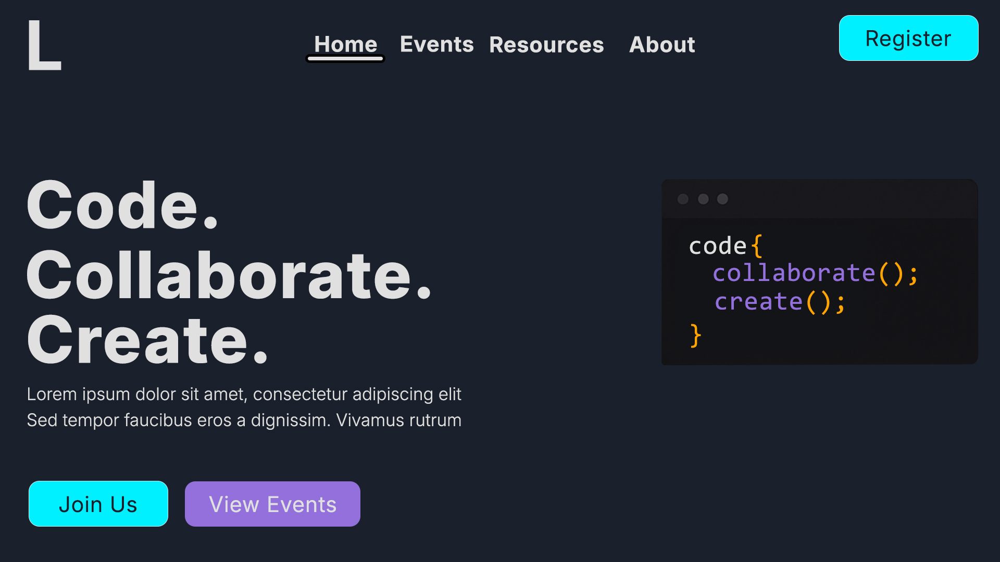
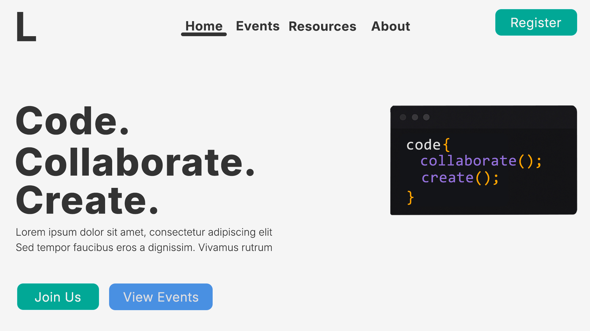
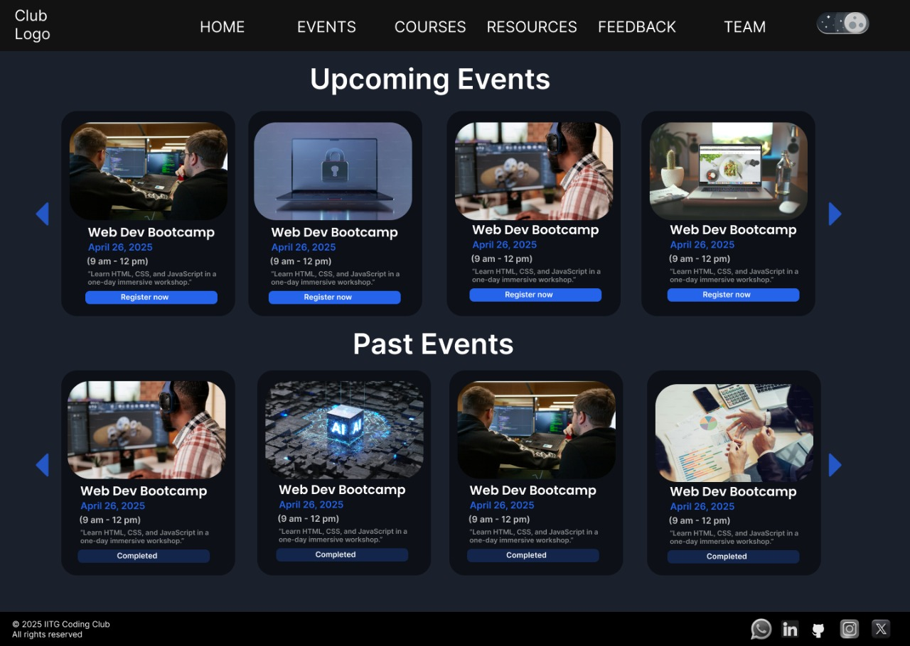
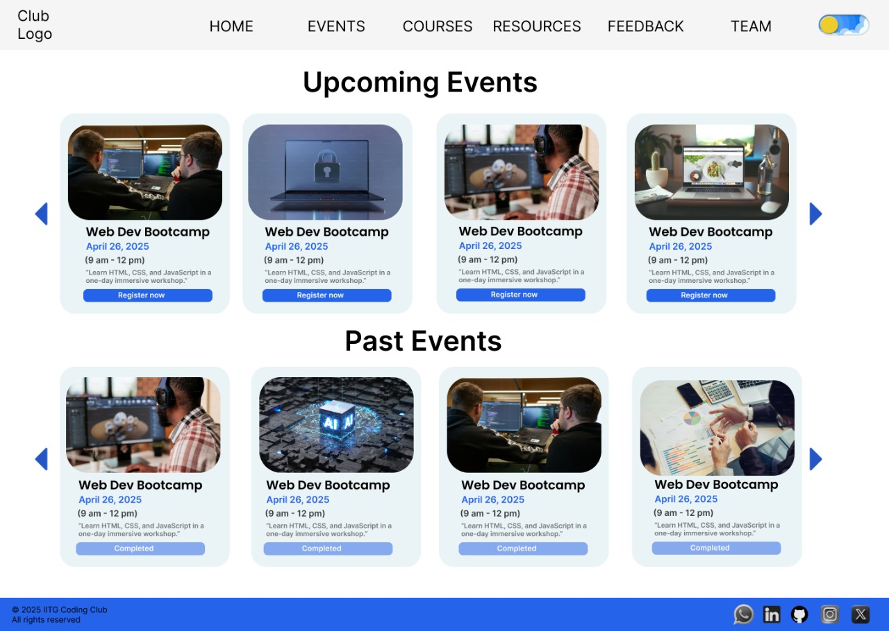
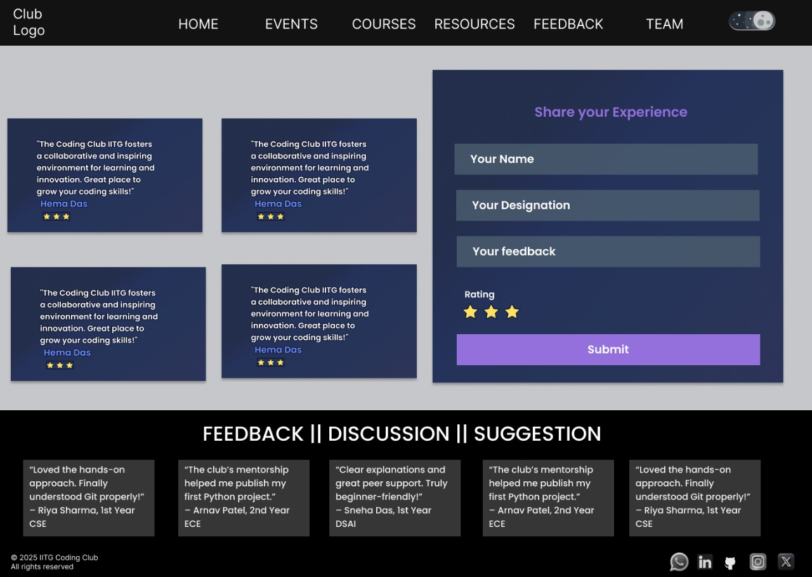
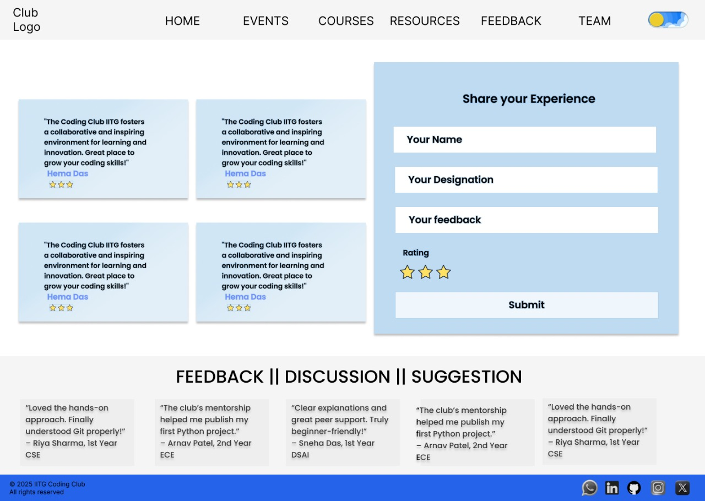

# Coding Club IITG

## Design Guide

### Color Codes

Dark:

- text: #E0E0E0
- background: #1A202C
- primary color: #00F0FF (used in button)
- secondary color: #9370DB (used in button)
- accent: #FFA500 (used in code snippet image)

Light:

- text: #333333
- background: #F5F5F5
- primary color: #00A896 (used in button)
- secondary color: #4A90E2 (used in button)
- accent: #FFA500 (same as dark mode)

For now use the [Inter](https://fonts.google.com/specimen/Inter) font and it's variations. It is subject to change.

### Homepage layout blueprint

### Reference images

- Logo 1

- Logo 2

- Homepage first/top view (Dark)

- Homepage first/top view (Light)

- Events (Dark)

- Events (Light)

- Courses (Dark)

- Courses (Light)

- Reviews (Dark)

- Reviews (Light)

### Note

Some texts are used as a placeholder and are subject to change.